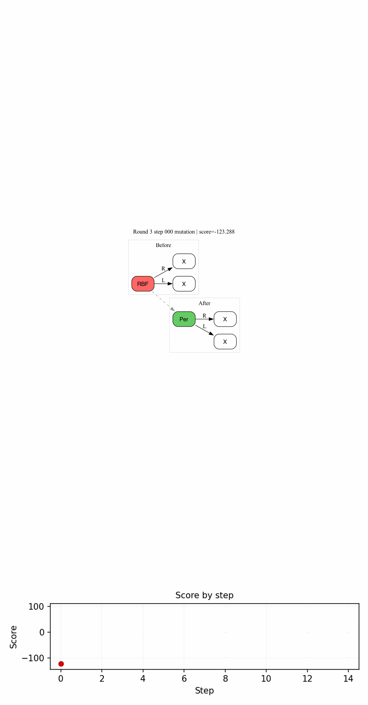

# BayesianSynthesis
Reimplementation of [Bayesian Synthesis of Probabilistic Programs for Automatic Data Modeling](https://arxiv.org/abs/1907.06249)

## Usage
1. Install dependencies
```bash
python -m venv .venv
source .venv/bin/activate
pip install -r requirements.txt
```
2. Run the notebook
```bash
jupyter notebook BayesianSynthesis.ipynb
```

3. Visualize the log run
```bash
python visualize_log_run.py
```

4. Get results similar to below.



5. Documentations
- Checkout the original paper for the most detailed and complete explanation: [Bayesian Synthesis of Probabilistic Programs for Automatic Data Modeling](https://arxiv.org/abs/1907.06249)
- Checkout [my blog](https://datvo06.github.io/blog/2026/bayesian-synthesis/) for the trimmed down version of it.